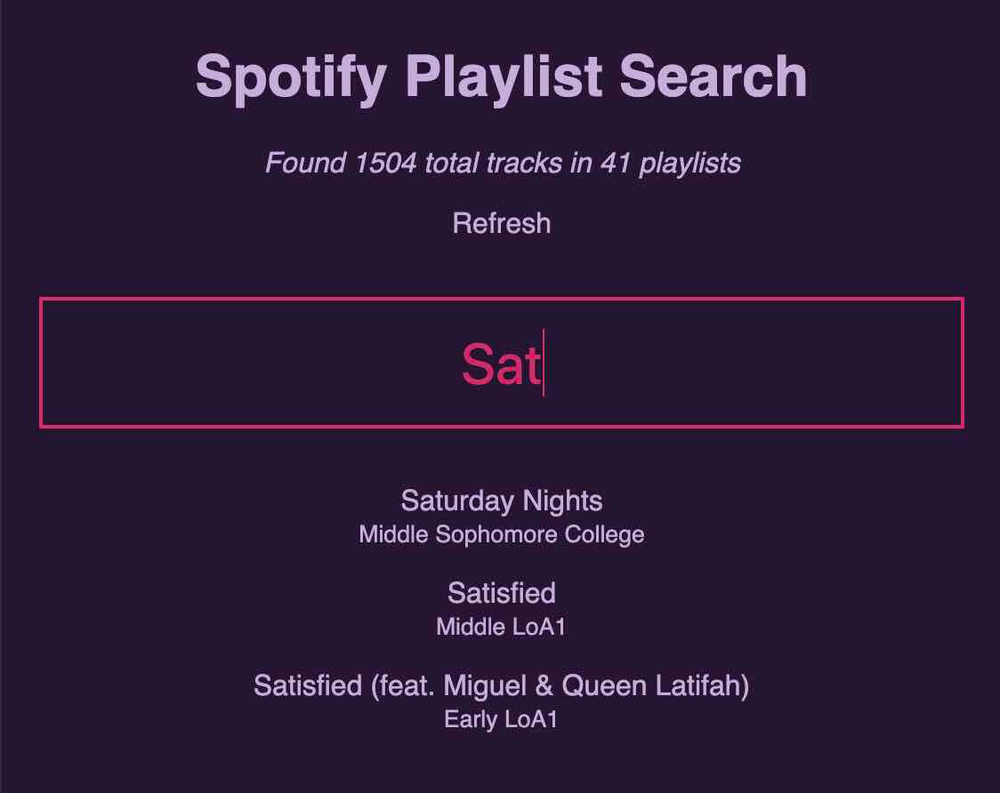

## Spotify Playlist Search

* **Context**: I make quarterly playlists on Spotify, and I don't like to repeat music from previous playlists
* **Problem**: Spotify makes it hard to search your playlists (you have to search each one)
* **Solution**: This small web-app retrieves all your playlists and let's you search the track names

Caveat: at the moment this is hardcoded for my Spotify account, `awendland`.

### Dev

NOTE: you must provide `SPOTIFY_CLIENT_ID` and `SPOTIFY_CLIENT_SECRET` in the environment.

* Use _yarn start_ to start the dev server (both client and FaaS)
* Use _yarn test_ to run unit tests
* Use _yarn build_ to build for production

This is an application built with [AppRun](https://github.com/yysun/apprun) and using [Netlify functions](https://www.netlify.com/docs/functions/).

### Quick Thoughts

This was shockingly easy to build. AppRun has a great approach that makes it super quick to hit the ground running. I'll probably using it for quickshot projects in the future :)

### Screenshot

